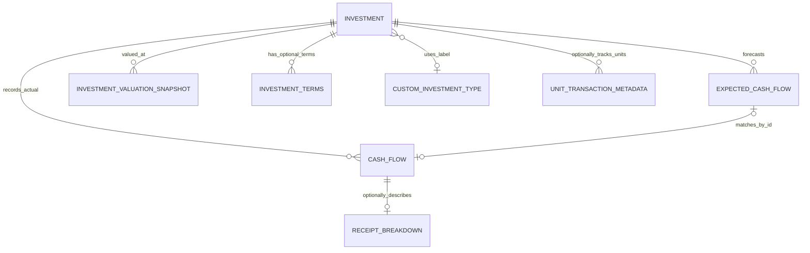

# InvTrack financial data model contract

Status: **target contract and migration guide**. This document distinguishes what the current model persists from the model future issues may add. It is not evidence that every target entity has already been implemented. Current code and tests remain authoritative where implementation differs.

## Non-negotiable invariants

1. **Actual money movement is the ledger.** Only a persisted `CashFlowEntity` represents money actually invested, received, or paid. Its amount is positive; `CashFlowType` determines direction (INVEST/FEE out, RETURN/INCOME in). Metadata must never create a second monetary flow.
2. **Valuation is a position, not cash.** A manual value, estimate, opening baseline, or historical valuation is not an actual receipt or purchase. It may be supplied as a dated terminal position to a performance calculation, but must not be persisted as a synthetic INVEST/RETURN/INCOME/FEE event.
3. **Expectations are not realized performance.** `ExpectedCashFlowEntity` describes a forecast/reminder. Until linked to a real cash-flow ID, it contributes zero to returned cash, net cash flow, XIRR, MOIC, and realized return. Matching links records; it does not copy money into the ledger.
4. **One calculation authority.** Portfolio and investment metrics are produced by `lib/core/calculations`. Screens, reports, reminders, exports, and feature-specific services must consume those results rather than reimplementing financial formulas.
5. **Currency is part of every amount.** Convert through the supported FX pipeline before aggregating. Missing currency/rates must be resolved explicitly or reported unavailable; never assume USD for a missing user currency or use a silent 1.0 FX rate. A legacy constructor default is not permission for a mapper to infer USD.
6. **Dates are calendar dates where the domain says date-only.** Normalize cash-flow, valuation-effective, start, maturity, and expected-payment dates consistently. Date-only values must not shift with local timezone or daylight-saving transitions. Month-based schedules clamp to the last valid day of the target month.
7. **Lifecycle and privacy apply to every entity.** Active/archived and open/closed are different dimensions. Archived investments remain excluded from active totals, goals, and FIRE under the current product decision. New user-owned data must be account-isolated, offline-safe, exportable/importable, backup/restorable, and deleted on account deletion. Never send amounts, notes, custom labels, file paths, or transaction descriptions to Analytics/Crashlytics.

## Canonical ownership

| Concept | Canonical owner | Contract |
|---|---|---|
| Investment identity and lifecycle | `InvestmentEntity` | Stable ID, built-in `InvestmentType`, open/closed status, archived state, the investment's own `currency` (its primary/display currency; `currentValue` is stated in it), created/updated timestamps and descriptive metadata. |
| Existing fixed-income terms | `InvestmentEntity` compatibility fields | Current flat fields (`expectedRate`, `compoundingFrequency`, `interestPayoutMode`, `startDate`, `tenureMonths`, `maturityDate`, `incomeFrequency`) remain readable. New typed terms should be introduced through an adapter, not an untyped map or big-bang schema rewrite. |
| Actual transactions | `CashFlowEntity` | Today: one actual amount, currency, date, type, investment ID and optional note; it has no principal/earnings/tax/fee breakdown fields. Target (not implemented): optional principal/earnings/tax/fee breakdowns would describe this same transaction; they would not be extra transactions. |
| Current value today (compatibility) | `InvestmentEntity.currentValue/currentValueDate` | Existing manual value and date remain the compatibility read/write path until all consumers have migrated. Keep amount and currency aligned. |
| Calculated valuation | `CurrentValueCalculator` / `InvestmentValuation` | Current code's `InvestmentValuation` is an in-memory calculation result with amount, currency, date, source and optional rate. `TerminalValues` creates ephemeral calculation flows; IDs prefixed `current-value:` must never be persisted. This is not yet a durable valuation-history entity. |
| Dated valuation history | `InvestmentValuationSnapshot` in `users/{uid}/valuations` (behind `FeatureFlag.valuationSnapshots`, #941) | Separate persisted entity with stable snapshot ID, investment ID, effective date, amount, currency, value kind and provenance (manual, opening baseline, import; estimates are never stored). `ValuationSnapshotSelector` reads the latest live snapshot in the investment's currency as of a date and never sums them; `currentValue/currentValueDate` mirrors the latest snapshot, written in the same batch. |
| Forecast payments | `ExpectedCashFlowEntity` | Expected amount and currency, expected date, prediction source/status, and optional matched actual cash-flow ID. Expected schedule is not a second ledger. Legacy: the entity also stores `actualAmount` and `actualDate`, copied from the matched cash flow by `income_guardian_sync_service.dart` and persisted in Firestore. Treat these as a denormalised copy; do not add more copied money fields, because matching links records and does not copy money. |
| Reusable custom category | Target account-scoped custom type definition | Stable definition ID and normalized label; built-in type remains `other`. A label must not activate calculation, tax, maturity, or valuation rules. Existing investments need a display-label fallback if a definition is renamed/archived/missing. |
| Quantity-based position | Target quantity/price metadata under #946 | Quantity and unit are not money. Price-per-unit has its own currency and effective date. Total value derives from quantity × price under #945 precision rules. |
| Receipt allocation | Target optional transaction breakdown under #940/#947 | Principal, earnings, gross, withholding, fees and net are attributes of a single transaction. Define exact reconciliation rules before adding UI or changing metrics. Open decision, tracked by #940/#947 and not decided here: once a receipt breakdown exists, whether `CashFlowEntity.amount` is the gross or the net figure. |

## Relationships

The diagram includes target entities to clarify ownership; the snapshot, typed terms, custom type, unit metadata and receipt breakdown are not all persisted entities in the current schema. Do not implement them as independent ledgers without a reviewed migration plan.

## Performance semantics

- **Cash-only metrics** (cash out, cash in, net cash flow) use actual cash flows only. Current value and expected payments never change these totals.
- **Current position** uses a dated valuation for an open investment when available. An estimate must be visibly labelled as estimated; a manual value must retain its effective date and currency.
- **Tracking-period return** may use a starting baseline at the tracking start date and a later applicable ending valuation. The baseline is a transient calculation input, not a synthetic cash-flow record. Label the tracking start date.
- **Lifetime return** requires enough original cost/date history to support the claim. If acquisition history is missing, lifetime XIRR/MOIC/gain is unknown or limited; do not relabel tracking-period results as lifetime results.
- **Valuation roll-forward** depends on value kind. Principal movements may update carrying value/principal outstanding only under explicit supported rules. They must not automatically change market value for gold, property, equity, funds, or private assets. Cash flows do not create a market price.
- **Expected versus actual** remains separate. A single actual flow cannot satisfy two expectations; partial/multiple matching must be explicit, currency-consistent and idempotent. Editing terms regenerates future expectations only, not historical actual flows.

## Money precision policy (coordinate with #945)

- Keep parsing, arithmetic, rounding, and locale formatting separate.
- Use currency-specific fraction digits and a documented rounding mode at input/persistence/reconciliation/output boundaries. Do not round each intermediate compounding step.
- Component sums must reconcile to the transaction total within the currency's permitted precision; do not silently discard a mismatch.
- Formatting is presentation only and never mutates calculation inputs.
- Preserve legacy numeric Firestore fields and current export formats during staged migration. A fixed-point/integer-minor-unit migration requires separate evidence, migration/rollback design, and old-app compatibility analysis.

## Compatibility and migration sequence

1. **Document and test contracts first.** Add exact-value unit tests for calculations and serialization before changing storage.
2. **Use adapters at boundaries.** Read legacy flat terms/current-value fields; map to typed domain values without losing currency/date/source. Write legacy fields until every reader/writer is migrated.
3. **Introduce new optional metadata only.** Older documents and exports without fields must deserialize unchanged. Never require users to recreate investments.
4. **Dual-read/write only with explicit precedence.** If canonical snapshots coexist with `currentValue/currentValueDate`, define deterministic conflict resolution and update/clear behavior. Do not allow stale compatibility data to overwrite a newer snapshot.
5. **Portability and lifecycle.** Update Firestore mapping, offline sync/conflict policy, archive/restore, backup/restore, export/import, account switching, and `AccountDataDeletionService.userCollections`/subcollections in the same feature PR. Verify every new collection is covered by deletion and export/import.
6. **Rollout and rollback.** Keep new UI behind a disabled-by-default feature flag. Preserve legacy reads during rollout. Do not delete old fields until read/write telemetry and migration checks prove every supported client is safe; telemetry must not include financial values or labels.

## Required regression matrix for data-model changes

| Scenario | Required assertion |
|---|---|
| Opening baseline without historical flows | Valuation is visible; no synthetic cash-flow row; lifetime metrics remain unknown/limited. |
| Snapshot history | As-of lookup chooses the latest snapshot at or before the date; snapshots are never summed. |
| Carrying value versus market value | Supported principal repayment can change carrying value; it does not mechanically change market value. |
| Expected versus actual | An unmatched expectation never changes realized metrics; matching links exactly one actual flow without duplicating money. |
| Principal/earnings/receipt components | Components reconcile to the same transaction and each metric counts the cash flow once. |
| Currency | Same-currency aggregation works; mixed currencies use valid conversion; absent currency/rate never silently becomes USD/1.0. |
| Date and precision | Month-end dates clamp, date-only values remain stable across timezones, and rounding happens only at documented boundaries. |
| Legacy documents | Missing new fields and legacy flat fields still deserialize and round-trip without lost values. |
| Lifecycle/portability | Archive/restore, backup/restore, export/import, offline edits, account switching and deletion preserve relationships and account isolation. |
| Privacy telemetry | Analytics/Crashlytics contain no financial amount, note, custom label, transaction description, file name or path. |
| Privacy mode | With privacy mode on, every amount is hidden in the UI, in semantics labels, in notifications and in share text. |
| Archived investments | Archived investments stay out of totals, goals and FIRE, and the UI says so wherever it matters. |
| Consumer consistency | Overview, detail, reports, goals and FIRE agree with the central calculation output for the same state. |

## Ownership and dependencies

- #944 owns this contract and the migration map.
- #945 owns precision/rounding behavior.
- #936 custom type definitions, #937 fixed-income terms, #938 expected/actual reconciliation, #939 reminders, #940 principal/earnings components, #941 dated/opening valuations, #946 quantity/unit-price positions, and #947 receipt allocations must follow this contract.
- Reuse #754's current-value calculation foundation, #761's FD/RD projector and #759's historical FX policy (#759 is still open, so that policy is pending and not yet available to rely on). Do not create parallel calculation engines or notification schedulers.
